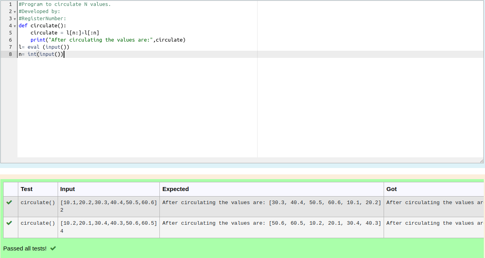

# Circulate-the-values-of-N-variables
## Aim:
To write a python program to circulate the n variables using function concept
## Equipment’s required:
PC
Anaconda - Python 3.7
## Algorithm: 
### Step 1:
 #Program to circulate N values.
### Step 2:
  circulate the values
### Step 3: 
Get the value from the user for the number of rotation
### Step 4: 
Using the slicing concept rotate the list
### Step 5: 
Print After Circulating the values are
### Step 6: 
print the result
## Program:
```
#Program to circulate N values.
#Developed by: R.Vignesh
#RegisterNumber:22008489
def circulate():
    circulate = l[n:]+l[:n]
    print("After circulating the values are:",circulate)
l= eval (input())
n= int(input())
```

## Output:


## Result:
Thus the circulate the n variables using function concept are successfully executed
